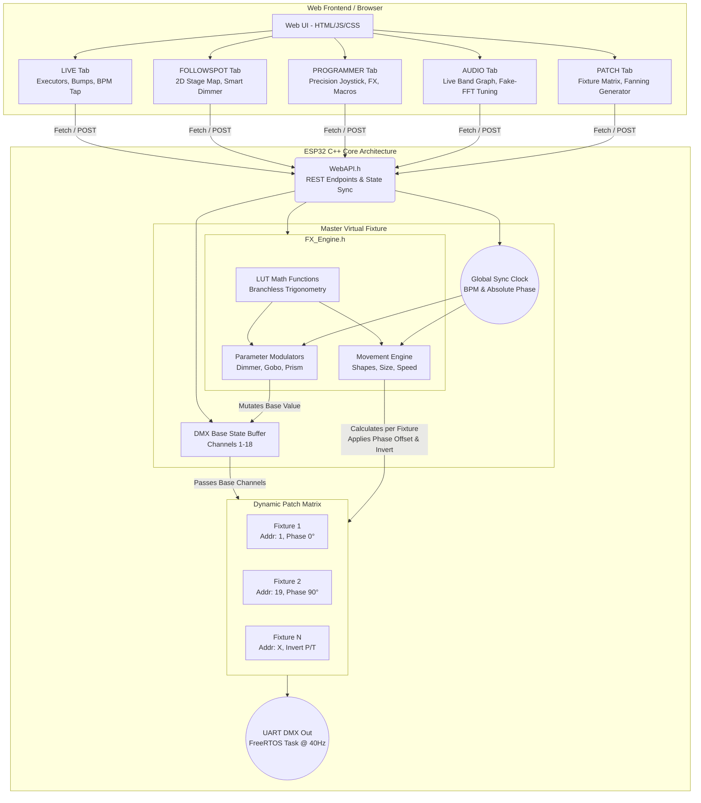

# Standalone-WIFI-ESP32-Moving-Head-Controller
Standalone WIFI ESP32 Moving Head Controller

---

# ESP32 Pro Fixture Console (i.e. Sheds, U'King, Fieryzeal)

A highly advanced, standalone, web-based lighting console and Art-Net node built on the ESP32. Originally tailored for 18-channel moving heads (like the SHEHDS 160W Pro), this project brings professional-grade console features—such as LFO modulators, BPM synchronization, executor playbacks, and a dedicated followspot engine—into a compact, zero-install embedded web application.

## Other names/brands
* Sheds 160W Pro
* Rudderstar 200W 3in1 LED Moving Head
* Fieryzeal 200W LED Moving Head
* Datewink 200W LED Moving Head
* U'King 200W LED Moving Head

* One click installer: https://doctormord.github.io/Standalone-WIFI-ESP32-Moving-Head-Controller/install.html
  ⚠️ Temporarily broken as of this restructuring — `install.html` points at `firmware/manifest.json`, and the `firmware/` folder (pre-built binaries for the old V1–V3 codebases) was removed as part of consolidating onto the current codebase below. Needs a fresh `firmware/` folder built from the current source before the installer works again.

## V2 Update Notes (Multi-Fixture & Performance Optimization)

Building on the foundation of V1 (which introduced the core web UI, basic modulators, and Art-Net support), V2 restructures the math engine and introduces a dynamic patching system to support multiple fixtures and precise synchronization.

### Technical Changes & New Features

* **Fixture Patching & Fanning:** Transitioned from a single-fixture hardcode to a dynamic matrix supporting up to 8 fixtures. A new *Patch Tab* allows configuration of DMX start addresses, Pan/Tilt inversion, and phase offsets per fixture. A fanning tool calculates and applies equidistant phase offsets across the configured fixtures.
* **2D Stage Calibration:** Added a visual mapping interface in the Followspot tab. It utilizes bilinear interpolation based on four calibration points to translate 2D image coordinates into precise Pan/Tilt angles.
* **Phase-Locked FX Engine:** Modulators and movement shapes no longer run freely. They are tied to a global beat clock — `beatCount` plus the fraction of the current beat elapsed — which advances at `globalBPM` and is nudged into phase by detected onsets. Beats are counted by that clock alone; an onset only corrects the phase, by a quarter of the error, and only when it lands within 15% of a grid beat. Counting a beat on an early onset instead used to jump every synced effect forward by up to 30% of a beat (measured at the DMX output: a 488ms cycle running as short as 336ms), and measuring the phase error against "time since the last beat" made it one-sided, so the grid could be pulled forward but never held back and slowly walked away from the music.
* **ESP32-C3 Math Optimization:** Since the ESP32-C3 lacks a hardware FPU for double-precision math, the C++ backend was refactored to reduce floating-point operations. Implemented a 1024-step Look-Up Table (LUT) for sine/cosine, branchless modulo arithmetic, and algebraic approximations for Gaussian curves to decrease frame calculation latency.
* **Expanded Movement Library:** Added Pan Sweep (Linear X), Tilt Sweep (Linear Y), Spiral, Ballyhoo, and Infinity Loop (Lemniscate).
* **BPM-Synced Fades:** Auto-Chaser transition times can now be parameterized using BPM divisions instead of static millisecond values.
* **UI Controls & Microstepping:** * Decoupled slider target values from live DMX output during auto-fades to enable blind programming.
  * Added keyboard modifier support for the joystick interface (`SHIFT` for fine steps, `SHIFT+ALT` for 1-bit microstepping) and disabled momentum physics during fine adjustment.
* **Codebase Refactoring:** Extracted REST API routing into a separate `WebAPI.h` file to isolate frontend communication from the core FreeRTOS DMX loop.

---

### V2 GUI

### System Architecture & Data Flow

The following diagram illustrates how the web frontend, the virtual master fixture, and the dynamic patch matrix interact:

## 🚀 Key Features since V1

* **Zero-Install Web Interface:** The entire UI is served directly from the ESP32's LittleFS flash memory. Accessible via any modern web browser (iOS, Android, Windows, Mac) with a highly responsive CSS-grid layout.
* **Dual Operation Modes:** Acts as a seamless Art-Net node (Universe 0) that automatically yields to internal standalone effects when activated.
* **Advanced FX Engine:** Generative, math-based movement and parameter modulation (LFOs) running at high refresh rates.
* **Global BPM Synchronization:** Unified timing engine with Tap Tempo (moving average) and real-time Audio/Mic Sync via Web Audio API (FFT analysis).
* **Non-Volatile Scene Memory:** Save up to 10 complete fixture states—including all active FX, modulators, and custom labels—directly to the ESP32's NVRAM.
* **Over-The-Air (OTA) Updates:** Flash new firmware over WiFi without USB cables, via `ArduinoOTA` (the standard Arduino IDE network port, or PlatformIO's `espota` upload protocol) once the device is connected in station mode. Note: this is an OTA *network port*, not an upload form in the web UI. It requires firmware from 2026-08-25 or later — earlier builds included the library and called `ArduinoOTA.handle()` but never called `ArduinoOTA.begin()`, so no OTA listener was ever started and OTA silently did not work at all.
* **Fully Offline-Capable:** The React/Babel frontend is bundled gzip-compressed on-device rather than loaded from a CDN, so the console works even when the ESP32's own WiFi AP has no internet uplink (a common venue scenario).
* **Adjustable UI Scale:** A tap-to-cycle 100/115/130% zoom control in the status bar for readability at dark venues, defaulting to 115% since pinch-zoom is disabled on mobile.
* **Save Center:** Re-save just a preset's pan/tilt center position on-site (after re-aiming a pre-programmed fixture) without touching any of its other saved FX/color/gobo settings, and without the full load → edit → save round trip.

---

## 🎛️ User Interface Architecture

The web application is divided into several operational tabs, allowing for flexible live performance and deep programming.

### 1. LIVE Tab (Performance Mode)
Designed for high-stress live environments, focusing on rapid access and execution.
* **Executor Pads:** 10 visual preset buttons for instant scene recall. Displays custom preset names dynamically.
* **Bump & Flash Controls:** High-priority momentary overrides (`BLACKOUT`, `FAST STROBE`, `50% STROBE`, `BLINDER`).
* **Master Panic Button:** `KILL ALL FX / STOP SHOW` safely halts all generative modulations and returns the fixture to a static state.
* **Show Auto-Chaser:** Automated sequential or random looping through stored presets. Includes adjustable crossfade times, hold times, and BPM sync multipliers (1/1 to 1/32 beats).
* **Global Sync Hub:** Tap-tempo button with 8-beat sliding average and a `SYNC PHASE` button to manually hard-reset all LFO and chaser phases.
* **Live Joystick:** A condensed Pan/Tilt XY-pad with axis inversion and instant `CENTER` recall.

### 2. FOLLOWSPOT Tab (Tracking Mode)
Transforms the moving head into a manually operated tracking spot with advanced physics.
* **Tracking Joystick Engine:** Features a customizable response curve (Linear to Exponential) and adjustable maximum speed for smooth, cinematic panning.
* **Axis Constraints:** Hard DMX limits (Min/Max) for Pan and Tilt to constrain the beam specifically to the stage area.
* **Smart Dimmer & Damping:** Adjustable "Smoothing" algorithm interpolates raw touch inputs into buttery-smooth DMX fades.
* **One-Shot Auto Fade:** Triggers automated fade-ins and fade-outs with configurable durations and transition curves (Linear, Sine, Quadratic).
* **Direct Beam Controls:** Quick access to Focus, Zoom, Color, Frost, and a dedicated `OPEN WHITE` panic button to clear all gobos/prisms instantly.

### 3. PROGRAMMER Tab (Setup & FX Mode)
The deep-dive configuration layer for building scenes and tweaking modulators.
* **Smart DMX Labels:** Automatically translates raw integer values into human-readable strings for complex channels (e.g., rotating gobos translate `135-255` into `[FWD]`, `[STOP]`, `[REV]` with percentage speeds).
* **Compound Dropdowns:** Merges base index selections (e.g., "Gobo 2") with continuous offset sliders (e.g., "Gobo Shake") into single UI elements.
* **Executor Grid + Save Center:** The same named preset grid as the LIVE tab (tap to recall, hold to save/rename) replaces a plain slot dropdown, so it's always visible which slot is loaded. A dedicated "Save Center" button re-saves only the current pan/tilt position back into the loaded slot.
* **Unsaved-Changes Guard:** Recalling a different slot only prompts for confirmation if something in the programmer has actually changed since the last recall/save — not on every tap.

### 4. AUDIO Tab (Diagnostics Mode)
A live view into the mic-reactive pipeline, so beat detection is observable and tunable rather than a black box.
* **Spectrum + Band Graph:** 256-bin spectrum with the three band ranges shaded and labelled, alongside a scrolling plot of the Low/Mid/High levels and their live thresholds, with beat-hit marks for all three bands. One request at 25Hz carries both.
* **Mic Level Meter:** True pre-clamp peak with a clipping indicator, so a badly set input is visible instead of guessed at. Also mirrored in the header on every tab.
* **Input Range:** `AUTO` by default (see below), or a fixed gain step.
* **Detector Tuning:** Every parameter of the detection chain — band edges, envelope release, reference time constant, threshold position, refractory behaviour, peak-picking, and the tempo window — live-settable via `/audio_tune` without a reflash, mostly as labelled dropdowns rather than sliders.

---

## 🧠 Advanced FX & Modulator Engine

The core of the console relies on an object-oriented C++ backend calculating DMX values in real-time based on sine, quadratic, cubic, and gaussian algorithms.

### Movement FX
* **12 Algorithmic Shapes:** Circle, Figure 8, Clover, Square, Star, Waterwave, Lissajous (Chaos), Pan Sweep, Tilt Sweep, Spiral, Ballyhoo, Infinity Loop.
* **Phase Rotation:** 0–360° continuous rotation of the geometric shape.
* **Dynamic Modulators:** LFO-driven scaling of both shape *Size* and *Speed* in real-time (e.g., to create pulsing or accelerating movement paths).

### Parameter Modulators (Dimmer, Gobo Rot, Prism Rot)
* **Waveforms:** Sine (Theater soft), Linear (Even), Quadratic (Fast end), Cubic (Very fast), Gauss (Lighthouse flash), Random (Flicker).
* **Modes:** Forward (Sawtooth) or Up/Down (Ping-Pong).
* **Ranges:** Configurable Start and End DMX boundaries.
* **Timing:** Free-running manual speed or locked to Global BPM Sync with beat multipliers.

### Step-Chasers (Color & Gobos)
* **Independent Engines:** Separate chasers for the Color Wheel, Static Gobo Wheel, and Rotating Gobo Wheel.
* **Range Selection:** Configurable start and end indexes (e.g., loop only from Color 2 to Color 5).
* **FX Overlays:** Injectable physical DMX offsets, such as overlaying a "Shake/Wobble" effect while the chaser steps through the gobos.

---

## 🥁 Beat Detection

Detection runs at the **sample rate**, not on FFT frames. An FFT frame is 32ms, but a kick's attack lasts 5–20ms, so frame-based detection can only ever timestamp on a frame boundary — ±32ms of jitter at a ~460ms beat, before any tempo estimator starts. The chain is modelled on the analogue topology of the Pioneer DJM-500, run per sample at 16kHz:

**bandpass → envelope → comparator against a rolling reference → peak pick → interval median**

* **Three independent bands.** Bass (40–159Hz, the kick), Mid (159–637Hz), High (above 1273Hz, hats and the snare's crack). Any effect can be triggered from any of them, so movement can sit on the kick while the dimmer flashes on the hats. Each band has its own recovery time, because a kick arrives once a beat while hats run at eighths or sixteenths.
* **The threshold is a position in the dynamic range**, `floor + fraction × (peak − floor)`, not a multiple of an average. That makes the sensitivity control dimensionless, so it does not have to be recalibrated when the material changes level. The floor is the window's **median**, not its mean — a mean is dragged upward by the very peaks it is supposed to measure against.
* **Onsets are taken at the envelope's peak**, not where it crosses the threshold: a crossing moves with the signal level, a peak does not, so intervals measured peak-to-peak are far more repeatable.
* **Tempo is the median gap between kicks**, with implausible gaps (outside 60–200 BPM) discarded at the input. A reading is only published when the gaps agree with each other; otherwise the previous value stands, and it must also sit within a band around a slowly-drifting reference — gating against the last published value instead made the band a step limiter, and four 15% steps carried the tempo from 122 to 66 in four seconds.
* **A tap anchors the tracker rather than overriding it.** The median gap answers "what period is there", not "which of its multiples is the beat", and on syncopated material those differ: measured on 97 BPM hip-hop, the detector locks onto 454ms, which is ¾ of the 619ms beat to within 1%. A tapped tempo identifies the rung, and the tracker's reading is folded onto it (½, ⅔, ¾, 1, 4/3, 3/2, 2). Auto tracking keeps running throughout; the tap is not a mode switch. Without a tap the reported tempo is whatever period the kicks actually have — correct for four-on-the-floor, an octave or a third off for anything syncopated.
* **Automatic input range.** The gain shift is selected automatically: down within a second when clipping (and straight to the right range in one step, since the level is measured before the clamp), up only after twenty seconds below range, because a quiet passage is ordinary music. Saturation *at the microphone* is detected separately and reported as `MIC SAT` — turning the gain down cannot undo it.
* **Cost is paid only when used.** The FFT is not part of detection any more and runs only while the AUDIO tab is open; Mid and High only run if an effect is actually routed to them.

Measured against synthesised audio with exactly known beat positions (see `sim/`): F-measure 0.99 with 100% precision and ~7ms timing error at 130 BPM, tempo correct within 2 BPM from 90 to 174 BPM, and detection holding across a 50× change in input level.

---

## ⚙️ Technical Specifications

* **Microcontroller:** ESP32 (e.g., WROOM-32, ESP32-S3), actually developent on a ESP32-C3 Super mini
* **DMX Output:** Hardware UART (Serial1) via MAX485 TTL-to-RS485 transceiver.
* **Baud Rate:** 250,000 bps (Standard DMX512 protocol).
* **Storage:** * UI Assets: LittleFS (Flash memory).
    * Scene Data: ESP32 Non-Volatile Storage (Preferences API).
* **Network:** mDNS support (`http://movinghead.local`), dynamic AP fallback (SSID: `Moving_Head_Ctrl`).
* **Frontend Stack:** React 18 with in-browser Babel JSX transpilation (`data/index.html`, no build step — edit and reload). React/ReactDOM/Babel are bundled gzip-compressed on-device (`data/vendor/`) rather than loaded from a CDN, so the UI works fully offline, including over the WiFi AP fallback with no internet uplink.

---

## 🔌 Default Fixture Profile (18-Channel Mode)
*Currently configured for SHEHDS 160W Pro. Easily adaptable via the configuration block in the source code.*

| Channel | Function | Channel | Function |
| :--- | :--- | :--- | :--- |
| **CH 1** | Dimmer | **CH 10** | Prism Insert |
| **CH 2** | Strobe | **CH 11** | Prism Rotation |
| **CH 3** | Pan | **CH 12** | Frost |
| **CH 4** | Tilt | **CH 13** | Focus |
| **CH 5** | Motor Speed | **CH 14** | Zoom |
| **CH 6** | Color Wheel | **CH 15** | Pan Fine |
| **CH 7** | Static Gobo | **CH 16** | Tilt Fine |
| **CH 8** | Rotating Gobo | **CH 17** | Auto Macros |
| **CH 9** | Gobo Index/Rot | **CH 18** | System Reset |

---

## 🛠️ Building From Source

No build system is required beyond the Arduino toolchain:

1. Arduino IDE or `arduino-cli`, board **"ESP32C3 Dev Module"**.
2. Set **`USB CDC On Boot` to Disabled** — otherwise the hardware reset after flashing won't work.
3. Set upload speed to **115200** to avoid timeouts.
4. Install the **`ArtnetWifi`** library (the only dependency beyond the ESP32 core; `WiFi`, `WebServer`, `Preferences`, `ArduinoOTA`, `ESPmDNS`, `Update`, and `LittleFS` all ship with the ESP32 board package).
5. Flash the sketch, then upload the **entire `data/` folder** (including `data/vendor/`) to the device's LittleFS with a LittleFS data-upload tool (or `pio run -t uploadfs` if using PlatformIO). **The `/upload_gui` fallback page on the device is not enough on its own** — it only replaces `index.html` itself, not `data/vendor/`, so a UI installed that way would 404 on `/vendor/react.js` and fail to load. It's meant purely as a first-boot/recovery path for the main HTML file.

Once on WiFi, the device is reachable at `http://movinghead.local` (mDNS) or via its AP fallback (SSID `Moving_Head_Ctrl`) if no station credentials are stored yet.

A `platformio.ini` is also included for command-line compile checks without the Arduino IDE:
- `pio run` — compiles the firmware.
- `pio run -t buildfs` — builds the LittleFS filesystem image from `data/` and verifies it actually fits the 896KB LittleFS partition (fails loudly instead of silently truncating). The project uses a custom partition table, `partitions_horizon.csv`: 1.5MB per OTA app slot and 896KB of filesystem, instead of the stock 1.25MB/1408KB. Switching a device onto it needs one USB flash with the filesystem included — the table is written at `0x8000` and OTA only ever writes an app slot.

Two further checks run entirely on the host:

- `./scripts/check_ui.sh` — transpiles every `<script type="text/babel">` block in `data/index.html` with the Babel already vendored in `data/vendor`, so a syntax error surfaces here instead of as a blank page on the device. There is no build step for the UI, so nothing else catches one. Needs only `node`.
- `cd sim && c++ -std=c++17 -O2 -I fake -I .. -o simbeat sim.cpp` — builds a host simulator that compiles the real `Audio_Engine.h` against a fake Arduino and a fake I2S driver, then drives it from either a synthesised track with exactly known beat positions or a `.wav` file. It models the DMA ring, the sample rate and the main loop's jitter, and reports precision/recall/F-measure and timing error. See `sim/README.md`.

All of these are compile/size/behaviour checks on the host, not a substitute for testing on real hardware — the simulator in particular knows nothing about microphones, rooms or PA compression.

## 📋 Known Issues

See `doc/content/backlog.md` for the current, full list. Headline item: the jog wheel (`/jog` endpoint, `jogBend`) is wired up in the UI but never read by the DMX/FX engines, so it currently has no visible effect on the fixture.

## 📚 Documentation

In-depth project documentation lives under `doc/content/` (in German — see `CLAUDE.md` for the project's language/documentation policy):

- `backlog.md` — open features, known issues, tech debt.
- `handover.md` — architecture deep-dive, performance notes, hardware rationale, planned extensions.
- `handoff.md` — current session snapshot for picking up work.
- `history.md` — append-only chronological development log.
- `functions.md` — full function/HTTP-API reference (English).

`sim/README.md` (English) documents the host simulator for the beat detector: how to run it, what it models, and — importantly — what it does not.

`CLAUDE.md` at the repo root has build/architecture guidance for AI coding assistants (Claude Code) working in this repository.

---
